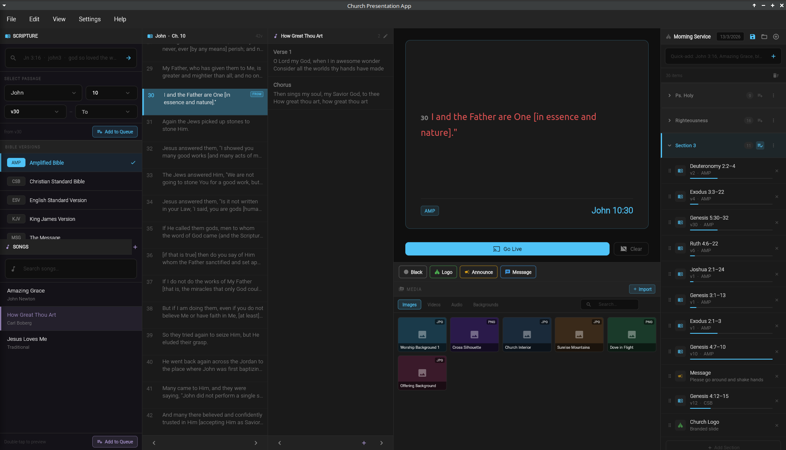

# Church Presentation App



## Directory layout

```
lib/
├── main.dart                          # App entry point + menu bar
├── app_theme.dart                     # AppTheme / ThemeNotifierWidget
├── models.dart                        # Data models (ServiceItem, ScriptureQueueItem, …)
│
├── utils/
│   └── book_alias_resolver.dart       # Resolves "Rev" → "Revelation", fuzzy typos, etc.
│
├── services/
│   ├── bible_service.dart             # SQLite DB loading, book/chapter/verse queries
│   └── service_plan_service.dart      # Save / load JSON service plans from disk
│
├── widgets/
│   ├── shared_widgets.dart            # Small reusable atoms (IconTip, NavBtn, DlgField…)
│   ├── scripture_panel.dart           # Col 1 top: search bar, passage picker, Bible versions
│   ├── verse_overview_panel.dart      # Col 2: verse rows, FROM/TO range, nav bar
│   ├── song_panel.dart                # Col 1 bottom: song list + search
│   ├── song_overview_panel.dart       # Col 3: song section list + editor dialog
│   ├── preview_panel.dart             # Centre: scripture / song / announcement / welcome preview
│   ├── service_plan_panel.dart        # Far right: plan list, sections, quick-add, save/load
│   └── media_panel.dart               # Bottom centre: media browser (Images/Videos/Audio)
│
└── screens/
    ├── home_screen.dart               # Thin orchestrator — state lives here, panels wired here
    └── projector_screen.dart          # Full-screen projector output window
```

---

## Where to go for common tasks

| Task | File |
|------|------|
| Bible DB is not loading / wrong data | `services/bible_service.dart` |
| "Rev 1:12" search not resolving | `utils/book_alias_resolver.dart` |
| Verse row colours / range highlight | `widgets/verse_overview_panel.dart` |
| Song section display / editor dialog | `widgets/song_overview_panel.dart` |
| Preview card (scripture / song / announcement) | `widgets/preview_panel.dart` |
| Service plan list, drag-reorder, sections | `widgets/service_plan_panel.dart` |
| Save / load service from disk | `services/service_plan_service.dart` |
| Media grid (Images / Videos / Audio) | `widgets/media_panel.dart` |
| App-wide colours / theme toggle | `app_theme.dart` |
| Data models (ScriptureQueueItem etc.) | `models.dart` |
| Keyboard shortcuts (arrow keys, Space, B) | `screens/home_screen.dart` |
| Small reusable buttons / chips / cards | `widgets/shared_widgets.dart` |

---

## State ownership

All mutable state (`_selectedBook`, `_activeIndex`, `_sections`, etc.)
lives in `_HomeScreenState` in `home_screen.dart`. Panels are **stateless
widgets** that receive data and callbacks as constructor parameters.

This means:
- Panels never own business logic — they just display and call back.
- When something goes wrong with *state*, look in `home_screen.dart`.
- When something looks wrong on screen, look in the relevant panel widget.
